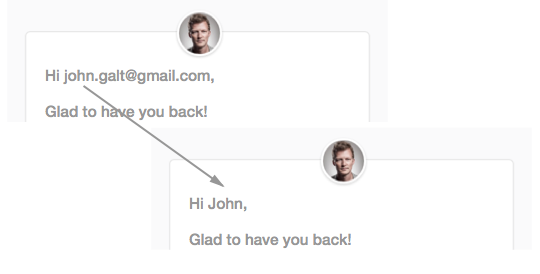

# Name Guesser

JSON API to guess a user's name and company from just an email address.

Inspired by [Genderize.io](http://genderize.io).

Made by the team at **Weld** ([www.weld.io](https://www.weld.io?utm_source=github-name-guesser)), the code-free app and web creation tool:

## Screenshot

## Supported email formats

* *@firstnamelastname - e.g. hello@greglarson.com
* *lastname@ - e.g. glarson@gmail.com
* firstname*@ - e.g. gregory231@gmail.com
* firstname-lastname@
* firstname.*@
* firstname.lastname.lastname@ (multiple last names) - e.g. greg.larson.smith@gmail.com
* firstname.lastname@ - e.g. greg.larson@gmail.com
* firstname@ - e.g. greg@gmail.com
* firstname@lastname - e.g. greg@larson.com
* firstname_lastname@
* firstnamelastname@ (short firstname) - e.g. greglarson@gmail.com
* firstnamelastname@ - e.g. greglarson@gmail.com
* firstnamelastname@ - e.g. greglarson@gmail.com
* lastname*@ - e.g. larsong231@gmail.com
* lastname.firstname@
* lastnamefirstname@ - e.g. larsongreg@gmail.com

## Usage

Request:

	http://localhost:9006/.json?email=jane.doe@google.com

Response:

	{
		email: "jane.doe@google.com",
		fullName: "Jane Doe"
		firstName: "Jane",
		lastName: "Doe",
		company: {
			name: "Google",
			id: "google",
			domain: "google.com"
		}
	}
